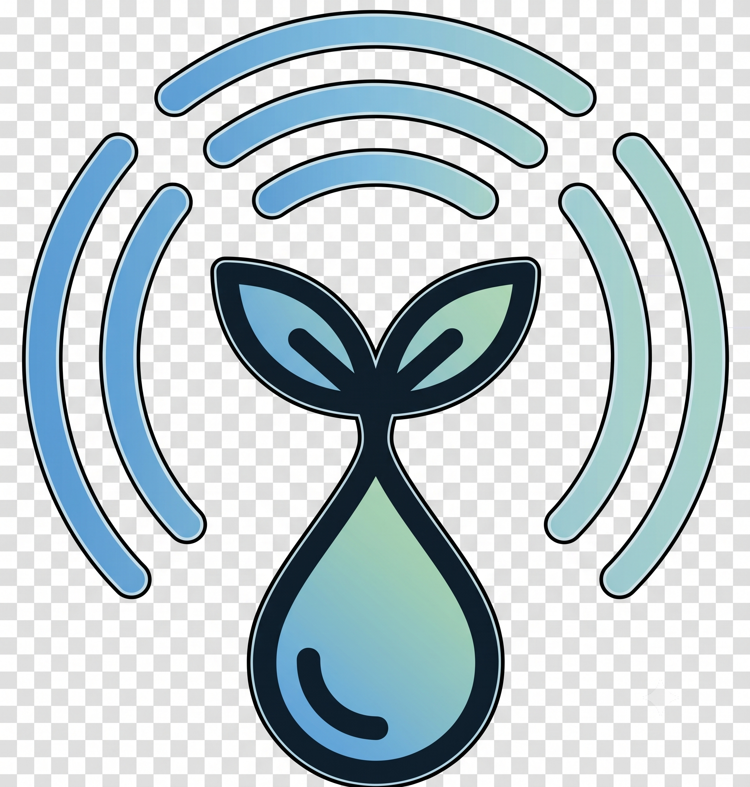

<p align="center">
  
</p>

<h1 align="center">FLoRa — Smart Irrigation Network</h1>

<p align="center">
  <b>Full-Stack IoT system for predictive agricultural irrigation based on a custom LoRa protocol</b>
</p>

<p align="center">
  
  
  
  
  
  
</p>

---

## 📌 Overview

**FLoRa** (_Field LoRa_) is a comprehensive IoT ecosystem designed, built, and field-tested as part of a Bachelor's Thesis (TFG) in **Computer Engineering** at the **University of Seville**. It addresses a real-world problem: the wasteful and imprecise irrigation practices that prevail in large-scale agriculture, especially in drought-affected regions like southern Spain.

The system covers the **entire engineering stack** — from custom hardware design with ultra-low power management and a proprietary LoRa communication protocol, to a cloud backend with an agronomic irrigation algorithm and an interactive web dashboard for farmers.

**FLoRa was validated during a 17-day real-world field deployment** on tomato farms at **Cooperativa Las Marismas de Lebrija (Seville)**, proving its viability under harsh outdoor conditions (extreme heat, wildlife interference, and rural network challenges).

### Key Numbers

| Metric | Value |
|---|---|
| **LoRa Range (tested)** | 1.6 km @ 5 dBm |
| **Mote Deep Sleep Current** | 16 µA |
| **Mote Battery Life (theoretical)** | 12+ years (limited by battery chemistry, ~3-5 years effective) |
| **Router Solar Recharge Time** | ~1h 20min for a full day of operation |
| **Router Off-Grid Autonomy** | ~6 days (no solar) |
| **Mote Battery Drain (field test)** | 3% over 15 days |
| **Cost per Sensor Node** | ~€30 – €80 (vs. €500 – €3,400 commercial) |

---

## 🏗️ Architecture

The system follows a **three-layer Fog Computing architecture** that minimizes costs and energy consumption:

```
┌─────────────────────────────────────────────────────────────────────────┐
│                    LAYER 3 — CLOUD (Proxmox VE / LXC)                   │
│                                                                         │
│  ┌──────────────┐    ┌───────────────────┐    ┌──────────────────────┐  │
│  │ Nginx Proxy  │───▶│  NestJS REST API  │◀──▶│ PostgreSQL + PostGIS │  │
│  │  Manager     │    │  (TypeScript)     │    │   (Prisma ORM)       │  │
│  │  SSL/HTTPS   │    │                   │    └──────────────────────┘  │
│  └──────┬───────┘    │  • BigPacket Svc  │    ┌──────────────────────┐  │
│         │            │  • Irrigation Alg │◀──▶│ Open-Meteo Climate   │  │
│         ▼            │  • OTA Shadowing  │    │   API (cached)       │  │
│  ┌──────────────┐    └───────────────────┘    └──────────────────────┘  │
│  │ React + Vite │                                                       │
│  │ Leaflet Maps │                                                       │
│  │ Tailwind CSS │                                                       │
│  └──────────────┘                                                       │
└────────────────────────────────┬────────────────────────────────────────┘
                                 │ GPRS / 2G (Movistar)
                                 │ HTTP + JSON BigPacket
┌────────────────────────────────▼────────────────────────────────────────┐
│              LAYER 2 — FOG / EDGE (Router / Gateway)                    │
│                                                                         │
│  Heltec WiFi LoRa 32 V3 (ESP32-S3)  +  AM-036 Cellular Modem (SIM800L)│
│  • FreeRTOS multitasking (Producer-Consumer LoRa RX)                   │
│  • Hybrid Batching: aggregates mote data into BigPackets               │
│  • GPS NEO-6M for geolocation                                          │
│  • Fuel Gauge MAX17043 for battery SoC                                  │
│  • Solar-powered (10W panel + 10,200 mAh 18650 battery bank)           │
│  • Power-Gating via MOSFET N+P cascade (High-Side Load Switch)         │
└────────────────────────────────┬────────────────────────────────────────┘
                                 │ LoRa 868 MHz (FLoRa Protocol)
                                 │ Encrypted + Anti-Replay
┌────────────────────────────────▼────────────────────────────────────────┐
│               LAYER 1 — PERCEPTION (Sensor Motes)                       │
│                                                                         │
│  Heltec WiFi LoRa 32 V3 (ESP32-S3) × N                                │
│  • Soil moisture sensor (resistive ADC)                                 │
│  • GPS NEO-6M (activated only during installation)                      │
│  • Li-Po 3.7V 2000mAh battery                                          │
│  • 16 µA Deep Sleep with Power-Gating (P-MOSFET IRLML6402)            │
│  • Finite State Machine firmware (sequential, single-task)              │
│  • LBT (Listen Before Talk) with Random Backoff before TX              │
└─────────────────────────────────────────────────────────────────────────┘
```

---

## 🛰️ The FLoRa Protocol

FLoRa is a **custom MAC-layer protocol** built from scratch on top of the LoRa physical layer. It was designed specifically for this project, inspired by CSMA/CA but optimized for LPWAN constraints:

- **LBT + Random Backoff** — Carrier sense via RSSI threshold (−80 dBm) with randomized back-off to avoid collisions, without the overhead of RTS/CTS.
- **Star topology** — All motes communicate exclusively with a central router, enabling 99% Deep Sleep duty cycles for the nodes.
- **4-channel plan** — Channels 0–2 on ETSI sub-band g1 (868.1–868.5 MHz, 1% duty cycle) and Channel 3 on g3 (869.525 MHz, 10% duty cycle). Guard bands of 75 kHz prevent inter-channel interference.
- **Binary packed frames** — All messages use `__attribute__((packed))` C++ structs (max 47 bytes for a DATA frame), minimizing Time-on-Air.
- **XOR encryption + Anti-Replay** — Frame counter (`fcnt`) validation prevents replay attacks; cryptographic errors trigger automatic resynchronization.
- **Autonomous fault tolerance (Auto-Failover)** — If a mote loses contact with its router after 7 accumulated failures, it can autonomously scan for and join a public backup network.
- **OTA Configuration (Device Shadowing)** — Configurations are piggybacked onto ACK responses via version counters, inspired by AWS IoT Device Shadows.
- **Network lifecycle** — Full Join/Leave/Resynchronization sequences with public/private network support.

---

## 🌾 Irrigation Algorithm

The backend runs an **hourly cron job** implementing the **FAO-56 methodology** for irrigation scheduling:

1. **Data freshness check** — Ignores parcels with no data in 24h.
2. **Crop evapotranspiration** — `ETc = ET₀ × Kc` (reference ET₀ from Open-Meteo API, crop coefficient from catalog).
3. **Soil water deficit** — `Deficit = (FieldCapacity − CurrentMoisture) × RootDepth`.
4. **Net water need** — `Need = Deficit + ETc − Rainfall`.
5. **Flood prevention** — Caps irrigation at the soil's maximum lamina.
6. **Actuation** — Converts mm to liters and minutes based on parcel area, flow rate, and irrigation system efficiency.

Results are persisted in the `TurnoRiego` table and displayed to the farmer with recommended irrigation schedules.

---

## 📂 Repository Structure

```
.
├── 📂 firmware/                    # Embedded C++ code (Arduino/PlatformIO)
│   ├── 📂 Mota/                    # Sensor node firmware (FSM, Deep Sleep, LoRa TX)
│   │   ├── maquinaEstadosMota.ino  # Main state machine
│   │   ├── lora_node.cpp/h         # FLoRa protocol client (LBT, Join, Data TX)
│   │   ├── sensors.cpp/h           # Soil moisture & battery ADC readings
│   │   ├── display.cpp/h           # OLED menu & UI
│   │   ├── storage.cpp/h           # NVS persistent storage
│   │   ├── Battery.cpp/h           # Battery voltage monitoring
│   │   ├── config.h                # Pin definitions & LoRa parameters
│   │   ├── types.h                 # Packed structs (LoRaMessage, SensorsData...)
│   │   └── images.h                # OLED bitmap assets
│   ├── 📂 Router/                  # Gateway firmware (FreeRTOS, multitasking)
│   │   ├── routerMain.ino          # Main entry, task creation & FreeRTOS setup
│   │   ├── lora_router.cpp/h       # FLoRa protocol coordinator (RX queue, ACK)
│   │   ├── AMcontrol.cpp/h         # AM-036 modem driver (Job queue, MOSFET ctrl)
│   │   ├── SerialAM_lib.cpp/h      # UART JSON protocol with AM-036
│   │   ├── network.cpp/h           # Network Management Functions & NTP time sync
│   │   ├── gps.cpp/h               # GPS NEO-6M handler
│   │   ├── fuelGauge.cpp/h         # MAX17043 battery SoC (I2C)
│   │   ├── rtc_sync.cpp/h          # Internal RTC calibration
│   │   ├── display.cpp/h           # OLED dashboard & menus
│   │   ├── storage.cpp/h           # NVS persistent storage
│   │   ├── config.h                # Router-specific configuration
│   │   └── types.h                 # Protocol types & BigPacket structures
│   └── 📂 AM036/                   # Cellular modem co-processor firmware
│       └── am036.ino               # SIM800L AT driver, GPRS HTTP client
│
├── 📂 backend/                     # Server-side infrastructure
│   ├── 📂 nestjs/                  # NestJS REST API (TypeScript)
│   │   ├── 📂 src/
│   │   │   ├── 📂 auth/            # JWT + Device Token Guards
│   │   │   ├── 📂 big-packet/      # Core telemetry ingestion service
│   │   │   ├── 📂 irrigationAlgorithm/  # FAO-56 cron job
│   │   │   ├── 📂 clima-service/   # Open-Meteo API client + spatial cache
│   │   │   ├── 📂 motas/           # Sensor nodes CRUD
│   │   │   ├── 📂 routers/         # Gateways CRUD + permitirAcceso endpoint
│   │   │   ├── 📂 parcelas/        # Parcels CRUD (GeoJSON polygons)
│   │   │   ├── 📂 usuarios/        # Users CRUD
│   │   │   ├── 📂 tipo-suelo/      # Soil types catalog
│   │   │   ├── 📂 tipo-cultivo/    # Crop types catalog (Kc values)
│   │   │   ├── 📂 tipo-riego/      # Irrigation types catalog (efficiency)
│   │   │   ├── 📂 turno-riego/     # Irrigation scheduling
│   │   │   ├── 📂 prisma/          # Prisma ORM service
│   │   │   └── 📂 time/            # Time utilities
│   │   ├── 📂 prisma/
│   │   │   ├── schema.prisma       # Database schema (10 models)
│   │   │   └── seed.ts             # Seed data for development
│   │   └── .env                    # Database connection string (not committed)
│   └── 📂 db/
│       └── docker-compose.yaml     # PostgreSQL + PostGIS container
│
├── 📂 frontend/                    # Farmer web dashboard
│   ├── 📂 src/
│   │   ├── 📂 pages/               # Login, Dashboard
│   │   ├── 📂 components/          # UI components, layout, views, auth
│   │   ├── 📂 context/             # React context providers
│   │   ├── 📂 services/            # API client services
│   │   └── 📂 utils/               # Helper utilities
│   ├── index.html
│   ├── vite.config.ts
│   └── tailwind.config.js
│
├── 📂 docs/                        # Technical documentation & media
│   ├── 📂 ExplanationDiagrams/     # Architecture, protocol & DB diagrams (PDF)
│   ├── 📂 ReporteFotograficoInstalacionCampo/  # Field deployment photos
│   ├── 📂 photos/WEB_UI/           # Web UI screenshots (light & dark themes)
│   └── 📂 SerialTest/              # Serial debugging utilities
│
├── 📂 Logo/                        # FLoRa project branding
│   └── FLoRa_logo.png
│
├── TFG_DavidRomeroPerez.pdf        # Full thesis document (Spanish)
└── README.md
```

---

## 🛠️ Hardware Stack

### Sensor Mote (×2 built)

| Component | Model | Purpose |
|---|---|---|
| MCU + LoRa | Heltec WiFi LoRa 32 V3 (ESP32-S3 + SX1262) | Processing + 868 MHz communication |
| GPS | NEO-6M + ceramic patch antenna | Field geolocation (manual activation) |
| Soil Sensor | Resistive moisture probe (ADC) | Soil conductivity measurement |
| Battery | Li-Po 3.7V / 2000 mAh | Primary power source |
| Power Switch | IRLML6402 P-MOSFET (SOT23-3) | High-Side Power-Gating for peripherals |
| DC-DC | Boost converter (adjustable) | 3.7V → 5V for GPS module |
| Interface | Mechanical button + 9kΩ pull-up | OLED menu navigation |
| Enclosure | IP67 weatherproof box + cable glands | Outdoor protection |

### Router / Gateway (×1 built)

| Component | Model | Purpose |
|---|---|---|
| MCU + LoRa | Heltec WiFi LoRa 32 V3 (ESP32-S3 + SX1262) | Network coordinator + LoRa RX |
| Cellular Modem | AM-036 (ESP32 + SIM800L) | GPRS 2G uplink to cloud |
| GPS | NEO-6M + ceramic patch antenna | Router geolocation |
| Battery Bank | 3× Samsung INR 18650 35E (10,200 mAh) | Primary power storage |
| Solar Charger | Waveshare Solar Power Manager | MPPT charging (6-24V input, 5V/3A out) |
| Solar Panel | 10W / 12V monocrystalline | Energy harvesting |
| Fuel Gauge | SparkFun MAX17043 (I2C) | Electrochemical battery SoC monitoring |
| Power Switch | IRLML2502 (N-ch) + IRF9540 (P-ch) cascade | 3.3V-controlled 5V High-Side Load Switch |
| Capacitor | 3,300 µF / 10V electrolytic | GPRS current spike stabilization |
| Enclosure | IP67 weatherproof box + cable glands | Outdoor protection |

---

## 🖥️ Software Stack

| Layer | Technology | Details |
|---|---|---|
| **Firmware** | C++ / Arduino / FreeRTOS | PlatformIO-compatible, Heltec V3 board support |
| **Backend API** | NestJS 11 + TypeScript | Modular REST API, JWT + Device Token auth |
| **ORM** | Prisma 6 | Type-safe queries, migrations, SQL injection prevention |
| **Database** | PostgreSQL 16 + PostGIS | Geospatial queries, Dockerized |
| **Frontend** | React 18 + Vite 5 + TypeScript | SPA with Tailwind CSS, Framer Motion animations |
| **Maps** | Leaflet.js + Esri World Imagery | Interactive satellite view with GeoJSON polygons |
| **Climate Data** | Open-Meteo API | ET₀, rainfall forecasts (spatially cached) |
| **Deployment** | Proxmox VE → LXC containers | Self-hosted, PM2 process manager |
| **Reverse Proxy** | Nginx Proxy Manager | SSL termination (Let's Encrypt), path-based routing |
| **DNS** | No-IP (flora.ddns.net) | Dynamic DNS with ddclient auto-sync |

---

## 🚀 Getting Started

### Prerequisites

- **Node.js** ≥ 18
- **Docker** & **Docker Compose** (for PostgreSQL)
- **Arduino IDE** or **PlatformIO** (for firmware flashing)
- Heltec ESP32 Dev-Boards library + RadioLib + TinyGPS++

### 1. Database

```bash
cd backend/db
docker compose up -d
```

### 2. Backend

```bash
cd backend/nestjs
npm install
# Configure your .env file with the database connection string:
#   DATABASE_URL="postgresql://flora_user:password:5432/flora_db"
npx prisma migrate dev     # Apply schema migrations
npx prisma db seed          # (Optional) Seed with sample data
npm run start:dev           # Start in development mode (port 3000)
```

### 3. Frontend

```bash
cd frontend
npm install
npm run dev                 # Start Vite dev server (port 5173)
```

### 4. Firmware

1. Open the desired project folder (`firmware/Mota/`, `firmware/Router/`, or `firmware/AM036/`) in **Arduino IDE** or **PlatformIO**.
2. Install required libraries: **Heltec ESP32 Dev-Boards**, **RadioLib**, **TinyGPS++**, and **RTClib**.
3. Adjust `config.h` for your network parameters (channel, SSID, encryption key).
4. Flash to the corresponding Heltec V3 or ESP32 board.

---

## 📸 Web Interface Preview

The platform features a modern, responsive UI with **dark/light theme support**, **interactive satellite maps** with Leaflet, real-time device telemetry, and intelligent irrigation management panels. Screenshots are available in [`docs/photos/WEB_UI/`](docs/photos/WEB_UI/).

A **full video demo** of the platform is available at:  
🎥 [FLoRa Web Platform Demo](https://drive.google.com/file/d/1hz5Ii9pwfNkn2F2pAU_9i95KqT3VS7XQ/view?usp=sharing)

---

## 🌿 Field Deployment

The system was tested over **17 days** in real tomato farms at **Las Marismas de Lebrija (Seville)**, in collaboration with the local agricultural cooperative. Photos of the installation are available in [`docs/ReporteFotograficoInstalacionCampo/`](docs/ReporteFotograficoInstalacionCampo/).

Key outcomes:
- ✅ LoRa coverage of **1.6 km** with minimal power (5 dBm)
- ✅ Stable GPRS connectivity (CSQ ~17) in rural areas
- ✅ Motes consumed only **3% battery in 15 days**
- ✅ Router achieved **perfect energy equilibrium** with the 10W solar panel
- ✅ Fully autonomous operation after initial bug fixes — **zero human intervention** during the final 15-day run

---

## 📄 Thesis

The full technical documentation is available in the thesis document:

📘 **[TFG_DavidRomeroPerez.pdf](TFG_DavidRomeroPerez.pdf)** — _"Diseño e implementación de un sistema IoT integral basado en LoRa para la optimización predictiva del riego agrícola"_

**University of Seville** · Grado en Ingeniería Informática – Ingeniería de Computadores  
Supervised by **Daniel Cagigas Muñiz** · Department of Computer Architecture and Technology  
July 2026

---

## 👤 Author

**David Romero Pérez**  
Bachelor's Thesis · University of Seville (2025/26)

---

## ⚖️ License

This project is licensed under the **MIT License** — see the [LICENSE](LICENSE) file for details.
